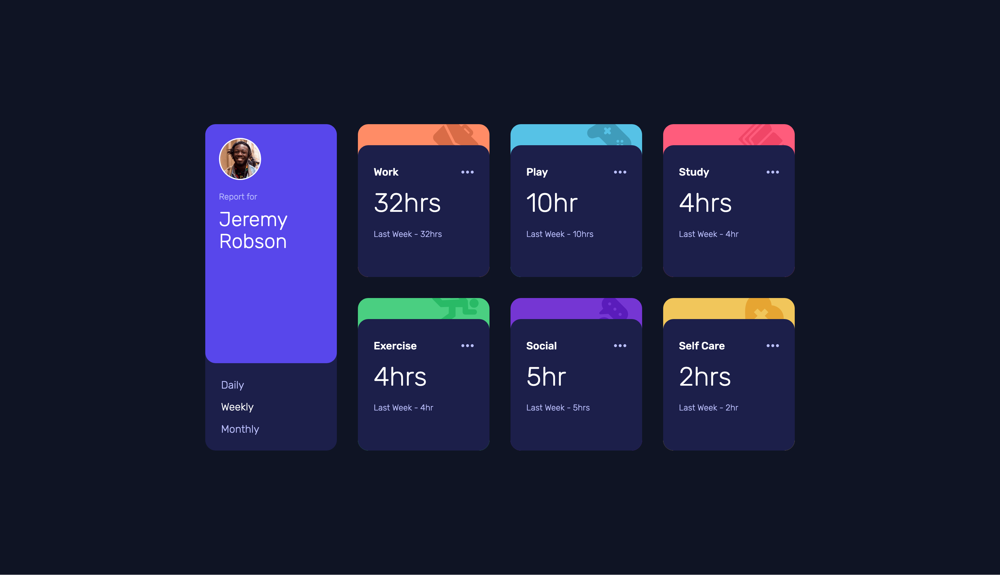
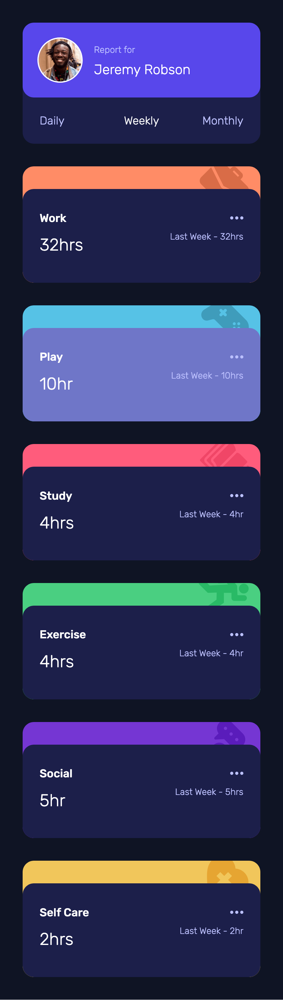

# Frontend Mentor - Time tracking dashboard solution

This is a solution to the [Time tracking dashboard challenge on Frontend Mentor](https://www.frontendmentor.io/challenges/time-tracking-dashboard-UIQ7167Jw). Frontend Mentor challenges help you improve your coding skills by building realistic projects.

## Table of contents

- [Frontend Mentor - Time tracking dashboard solution](#frontend-mentor---time-tracking-dashboard-solution)
  - [Table of contents](#table-of-contents)
  - [Overview](#overview)
    - [The challenge](#the-challenge)
    - [Screenshot](#screenshot)
    - [Links](#links)
  - [My process](#my-process)
    - [Built with](#built-with)
    - [What I learned](#what-i-learned)
  - [Author](#author)

## Overview

### The challenge

Users should be able to:

- View the optimal layout for the site depending on their device's screen size
- See hover states for all interactive elements on the page
- Switch between viewing Daily, Weekly, and Monthly stats

### Screenshot




### Links

- Solution URL: [https://www.frontendmentor.io/solutions/responsive-time-tracking-dashboard-0tAvDobUq4](https://www.frontendmentor.io/solutions/responsive-time-tracking-dashboard-0tAvDobUq4)
- Live Site URL: [https://fr-ux-en.github.io/time-tracking-dashboard/](https://fr-ux-en.github.io/time-tracking-dashboard/)

## My process

### Built with

- Semantic HTML5 markup
- CSS custom properties
- Flexbox
- CSS Grid
- Mobile-first workflow
- JS fetch, async, await

### What I learned

```js
/*
  fetch, async, await
*/
async function getDailyData() {
  try {
    const response = await fetch('data.json');
    const data = await response.json();
  } catch (error) {
    console.error('Error fetching daily data: ', error);
    return [];
  }
}
```

## Author

- LinkedIn - [Daniel Lee](https://www.linkedin.com/in/uniqueimaginate/)
- Frontend Mentor - [@FR-UX-EN](https://www.frontendmentor.io/profile/FR-UX-EN)
